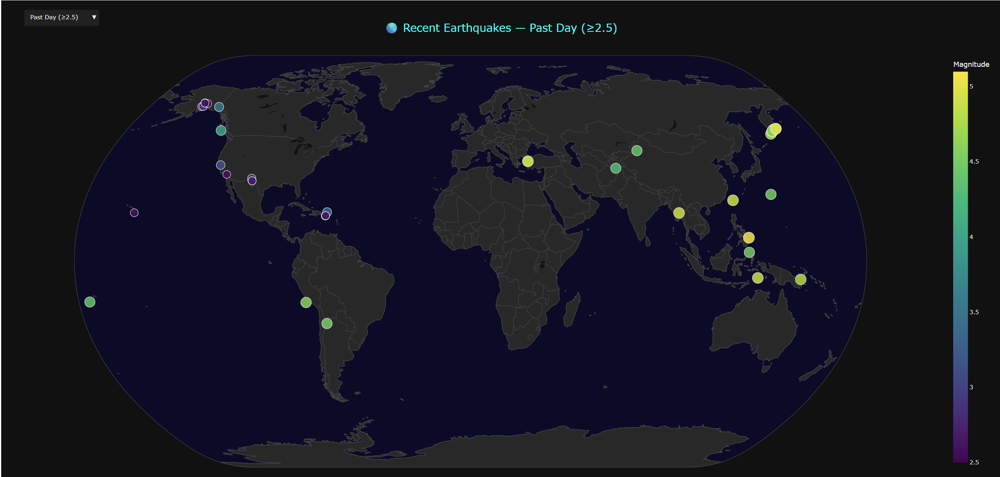

# QuakerTracker



## About this app
Uses pandas, plotly/dash, and USGS data to create a global visualization of 
recent earthquakes with a magnitude of ≥ 2.5.


Seen a simple example of something similar while doom scrolling social media
and thought I could do a little better. Really just an excuse to spend a lazy Sunday 
doing a refresher on Plotly/Dash.

### [Original snippet](./original_snippet.py) fom [PythonCoding](https://www.youtube.com/PythonCoding)


## Requirements

* Python 3

## How to run this app

We suggest you to create a virtual environment for running this app with 
Python 3.

Clone this repository.

```bash
git clone https://github.com/djjohns/QuakerTracker.git
```

Change into the projects root directory.

```bash
cd QuakeTracker
```

### In Unix systems. (Mac/Linux):

Create a python virtual environment to install the project's dependencies.

```bash
python3 -m virtualenv venv
```

Activate the virtual environment.

```bash
source venv/bin/activate

```

Install all required packages by running:
```bash
pip install -r requirements.txt
```

Run this app locally with:
```bash
python app.py
```

### In Windows: 

Create a python virtual environment to install the project's dependencies.

```bash
python -m venv venv
```

Activate the virtual environment.


```bash
venv\Scripts\activate
```

Install all required packages by running:
```bash
pip install -r requirements.txt
```

Run this app locally with:
```bash
python app.py
```

## Resources

* [Dash](https://dash.plot.ly/)
* [Pandas](https://pandas.pydata.org/docs/)
* [USGS](https://www.usgs.gov/)